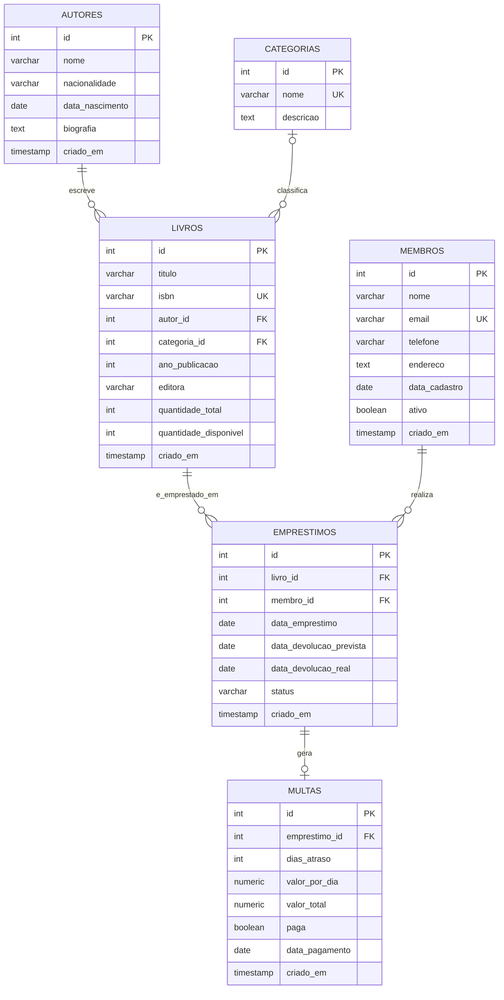

# Diagrama ER - Sistema de Biblioteca

## Cardinalidades

| Relacionamento | Cardinalidade | Observação |
|---|---|---|
| Autor → Livros | 1:N | Um autor pode ter vários livros; todo livro tem exatamente um autor (`NOT NULL`) |
| Categoria → Livros | 1:N (opcional) | `categoria_id` aceita `NULL` (`ON DELETE SET NULL`) |
| Livro → Empréstimos | 1:N | Um livro pode ter vários empréstimos ao longo do tempo |
| Membro → Empréstimos | 1:N | Um membro pode ter vários empréstimos |
| Empréstimo → Multa | 1:0-ou-1 | Gerada automaticamente por trigger apenas quando há atraso na devolução |
