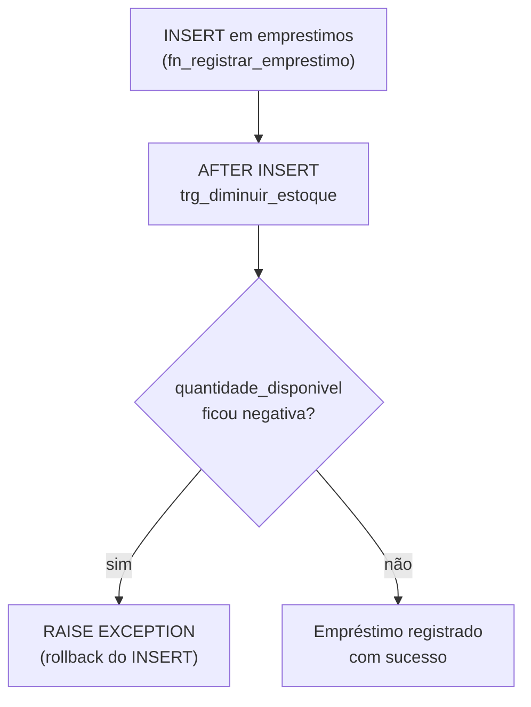
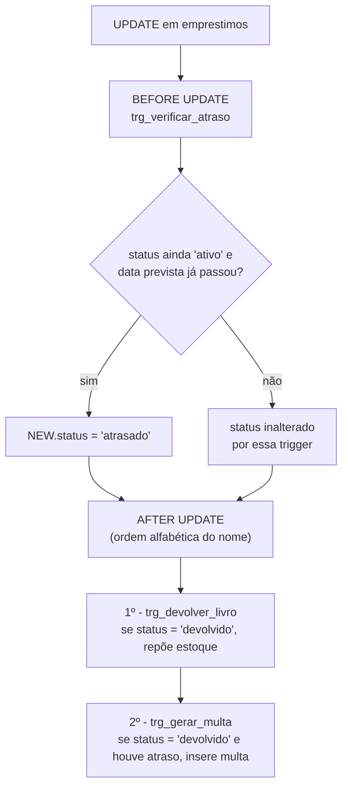

# Ordem de Disparo dos Triggers

Este documento mostra a ordem em que as triggers definidas em `03_triggers.sql`
entram em ação. Só olhar o arquivo de cima para baixo pode confundir um pouco:
a execução depende de cada trigger ser `BEFORE` ou `AFTER`. Quando duas triggers
respondem ao mesmo evento no mesmo momento, o PostgreSQL usa a ordem alfabética
do **nome da trigger** e não a ordem em que elas aparecem no script.

## Fluxo 1 - Novo empréstimo (`INSERT` em `emprestimos`)

Nesse caso, apenas a `trg_diminuir_estoque` é acionada. Ela reduz o estoque do
livro e cancela o empréstimo caso não haja exemplares disponíveis.

## Fluxo 2 - Atualização do empréstimo (`UPDATE` em `emprestimos`)

Vale prestar atenção em alguns detalhes:

- Como `trg_verificar_atraso` é uma trigger **BEFORE UPDATE**, ela roda antes das
  demais e antes de a alteração ser gravada na tabela.
- `trg_devolver_livro` e `trg_gerar_multa` são triggers **AFTER UPDATE**. Nesse
  cenário, o PostgreSQL as executa em ordem alfabética pelo nome, não pela ordem
  de criação. Por isso, `trg_devolver_livro` vem antes de `trg_gerar_multa`.
- Na devolução feita por `fn_registrar_devolucao`, o status já é atualizado para
  `'devolvido'`. A `trg_verificar_atraso` ainda é chamada, mas não altera nada,
  pois só atua quando o empréstimo continua com status `'ativo'`. Ela cobre,
  por exemplo, atualizações de rotina que verificam empréstimos ativos sem mudar
  o status manualmente.
